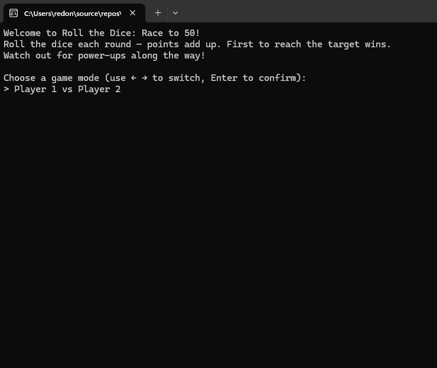

# 🎲 Roll the Dice: Race

A console-based dice game in C# where two players (or you vs. a CPU opponent) race to a target score — with random power-ups that can double your points, shrink them, steal from your opponent, or even swap total scores outright.



## How it works

Choose a game mode, then take turns rolling a six-sided die. Points from each roll add up to your total score. The first player to reach the target score (default: 50) wins. Along the way, random power-ups can trigger and shake up the outcome of a roll — for better or worse.

## Features

- **Two game modes**, selectable with the arrow keys before the match starts:
  - Player 1 vs Player 2 (enter custom names for both)
  - You vs Enemy (CPU opponent rolls automatically)
- **5 power-ups**, each with its own console animation:
  - 🌱 **Giant Growth** — doubles your points for the roll
  - 📉 **Shrink Ray** — halves your points for the roll
  - 🍀 **Lucky Star** — grants +3 bonus points
  - 🕵️ **Pickpocket** — steals points from your opponent
  - 🔄 **Score Swap** — swaps total scores between both players
- Each player is assigned a random, distinct color used to highlight their name throughout the game
- CPU opponent rolls on its own, no key press needed
- Clean object-oriented structure built around an `IPowerUp` interface, so new power-ups can be added without touching existing code

## Tech stack

- C# / .NET
- Console application (no external libraries)

## Getting started

**Requirements:** [.NET SDK](https://dotnet.microsoft.com/download) installed.

```bash
git clone https://github.com/Reggynald/RollTheDiceRace.git
cd RollTheDiceRace/RollTheDiceRace
dotnet run

Alternatively, open the .sln file in Visual Studio and press F5.
Project structure

RollTheDiceRace/
├── RollTheDiceRace.sln
└── RollTheDiceRace/
    ├── Program.cs          # Entry point
    ├── Dice.cs             # Dice rolling logic
    ├── Player.cs           # Player state (name, score, color)
    ├── IPowerUp.cs         # Power-up contract
    ├── PowerUps.cs         # Power-up implementations + animations
    ├── PowerUpPool.cs      # Random power-up selection
    └── Game.cs             # Game loop, mode selection, round logic

What I learned / practiced

This project builds on an earlier, simpler dice game and focuses on extensibility: the power-up system is built around an IPowerUp interface, so each power-up is a self-contained class that can be added to the pool without modifying any existing game logic (open/closed principle). It was also a chance to work with ref parameters, console-based animations using cursor control (\r overwrites), and small UI touches like an arrow-key-driven menu built without any external library.
Roadmap

Minigames between rounds are planned next — winning or losing a quick minigame will grant or block a power-up, adding another layer of comeback potential.
